# GRUPO_2-3
Repositorio colaborativo del grupo 2-3, para la resolución de la actividad grupal de la asignatura: Introducción a la Programación Científica.

## Descripción del proyecto
### 🧬 Esquema del pipeline



Se presenta un un proyecto colaborativo por los integrantes del grupo 2-3 (alumnos de la UNIR en el **Master en Bioinformática**) para el análisis de RNA-seq.

El objetivo de este proyecto es la construcción de un **pipeline automatizado mediante Snakemake**, compuesto por siete scripts que cubren todas las etapas necesarias para el procesamiento y análisis de datos transcriptómicos. A través de este *workflow*, se ejecutará el análisis completo desde cero, estructurando de forma clara y reproducible el orden y la lógica de ejecución de cada uno de los scripts mediante un archivo *snakefile*.

Todos los integrantes del grupo y creadores del repositorio colaborativo quedan reflejados en el archivo *Integrantes.txt*.

### Instalación de entorno Conda

```bash
conda env create -f envs/rnaseq-pipeline.yaml
conda activate rnaseq-pipeline
```

## Ejecución del pipeline

1. **Preparar los archivos necesarios**:
   - Añade tus URLs en `config/samples.txt` (una por línea, forward y reverse consecutivos).
   - Asegúrate de tener:
     - El archivo de anotación `.gtf` en `genome/annotation_files/`
     - El índice HISAT2 del genoma en `genome/genome_index/`

2. **Ejecutar el pipeline**:

```bash
snakemake --cores 4 --use-conda
```

Para ver los pasos sin ejecutarlos (modo dry-run):

```bash
snakemake --cores 4 --use-conda --dry-run
```

## Input Esperado

- `config/samples.txt`: lista de URLs de archivos `.fastq.gz` en orden (forward seguido del reverse).
- `genome/genome_index/`: índice del genoma de referencia creado con `hisat2-build`.
- `genome/annotation_files/genomic.gtf`: archivo de anotación.

## Output Generado

- **`results/fastqc/`**: Informes de calidad por muestra (`*_fastqc.html`)
- **`results/hisat2/`**: Archivos `.bam` alineados y ordenados + índices `.bai`
- **`results/featurecounts/`**:
  - `combined_gene_counts.txt`: matriz de conteos cruda
  - `cleaned_gene_counts.txt`: matriz de conteos limpiada
- **`results/deseq2/`**:
  - `differential_expression_results.txt`: tabla con resultados DESeq2
  - `volcano_plot_with_labels.png`: volcano plot
  - `pca_plot.png`: gráfico PCA
  - `heatmap_genes_significativos.png`: heatmap de genes significativos

## Descripción de los pasos

1. **`download`**: Descarga archivos `.fastq.gz` desde URLs definidas.
2. **`quality_control`**: Evalúa la calidad de los FASTQ con FastQC.
3. **`mapping`**: Alinea los reads con HISAT2 y ordena los BAM.
4. **`quantification`**: Cuenta las lecturas por gen con FeatureCounts.
5. **`deseq2`**: Análisis de expresión diferencial (DESeq2).
6. **`pca_plot`**: Visualización PCA de muestras.
7. **`heatmap`**: Heatmap de genes diferencialmente expresados.

## Notas importantes

- Se recomienda **no subir los archivos del genoma ni los FASTQ al repositorio**. Añade las rutas `genome/` y `data/` al `.gitignore`.
- El pipeline es fácilmente escalable y reproducible, y puede adaptarse a otros experimentos transcriptómicos con cambios mínimos.

##  Créditos

Desarrollado por el grupo 2-3 como parte del proyecto final de la asignatura de Bioinformática.  
Basado en herramientas de código abierto ampliamente utilizadas en genómica computacional.


## Requisitos

Snakemake
Python 3.x
R y las librerías: DESeq2, ggplot2, ggrepel, pheatmap
Herramientas externas: wget, fastqc, hisat2, samtools, subread (featureCounts)
